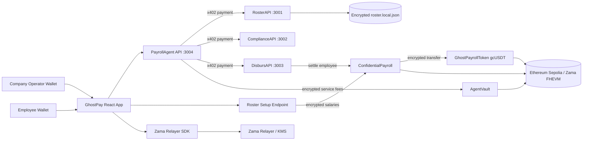
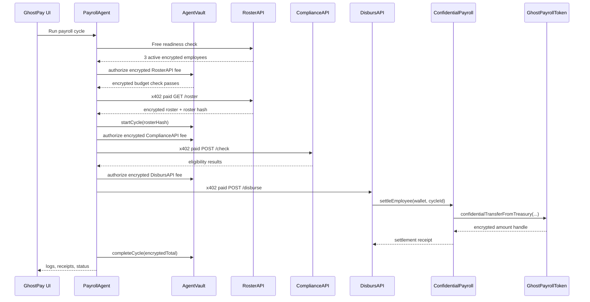
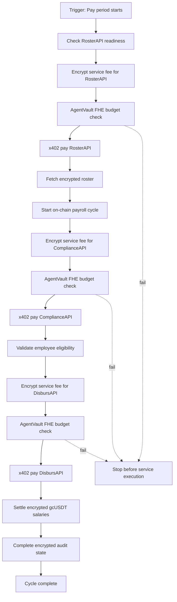

# GhostPay / fhex402

GhostPay is a private AI-agent payroll rail built with Zama FHEVM and x402.

A company connects a wallet, deposits an encrypted service budget, prepares an encrypted employee roster, and lets a server-side payroll agent execute the full payroll cycle. The agent pays three real HTTP services through x402 while Zama FHE keeps budgets, spend totals, salary records, and payroll-token balances confidential on Ethereum Sepolia.

## Why GhostPay

Enterprise payroll has a simple problem on public blockchains: everyone can see everything. Payroll amounts, employee compensation, company budget balances, and operational spend are all sensitive.

GhostPay shows how a company can automate payroll with an AI agent without revealing those values publicly:

- x402 handles paid API calls between the agent and service providers.
- Zama FHEVM enforces encrypted budget checks on-chain.
- Employee salaries are stored as encrypted handles.
- Salary settlement uses a custom confidential token, `gcUSDT`.
- The company can decrypt audit totals.
- Each employee can decrypt only their own confidential balance.

## Product Flow

1. Company deploys contracts on Ethereum Sepolia.
2. Company deposits an encrypted AgentVault budget.
3. Company uploads a CSV/JSON roster through the Payroll tab.
4. The backend encrypts salaries with Zama, registers employees, funds the confidential payroll treasury, and stores only encrypted salary handles for RosterAPI.
5. The payroll agent runs a cycle:
   - pays RosterAPI through x402
   - pays ComplianceAPI through x402
   - pays DisbursAPI through x402
   - settles encrypted `gcUSDT` payroll transfers
6. Company audits encrypted budget/spend totals.
7. Employees open the Employee tab and decrypt only their own balance.

## Architecture



## Payroll Cycle Sequence



## n8n-Style Workflow

The payroll agent behaves like an automated workflow. Each node has a clear input, output, payment, and privacy boundary.



## Privacy Model

| Data | Where It Lives | Publicly Visible? | Who Can Decrypt |
| --- | --- | --- | --- |
| AgentVault budget | `AgentVault` encrypted state | No | Company owner through audit flow |
| AgentVault spent total | `AgentVault` encrypted state | No | Company owner through audit flow |
| Employee salary amount | `ConfidentialPayroll` encrypted handle | No | Authorized employer/employee access only |
| Roster served to agent | RosterAPI encrypted file | Names/wallets yes, salary values no | Salary handles stay encrypted |
| x402 API fee amount | x402/Base Sepolia USDC payment | Yes, tiny service fee | Public by design |
| Salary settlement amount | `GhostPayrollToken` encrypted transfer | No | Recipient wallet can decrypt own balance |
| Employee `gcUSDT` balance | `GhostPayrollToken` encrypted balance | No | That employee wallet |

Important: plaintext roster files such as `roster.plain.local.json` are local admin input only. They are ignored by git. In production, the company uploads CSV/JSON through the UI, the backend encrypts salaries, and only encrypted roster data is retained.

## Network Split

| Layer | Network | Reason |
| --- | --- | --- |
| FHE contracts | Ethereum Sepolia `11155111` | Zama FHEVM host chain |
| x402 service payments | Base Sepolia `eip155:84532` | Supported by the public x402 facilitator |
| Salary settlement | Ethereum Sepolia `11155111` | Confidential `gcUSDT` balances and encrypted transfers |

Base Sepolia is only the API micropayment rail. Private salary settlement remains on Ethereum Sepolia with Zama FHE.

## Monorepo Layout

| Path | Purpose |
| --- | --- |
| `packages/contracts` | Solidity contracts, Hardhat tests, Sepolia deployment script |
| `packages/frontend` | Vite + React UI for company, audit, payroll, and employee views |
| `packages/services` | RosterAPI, ComplianceAPI, DisbursAPI, PayrollAgent |

## Smart Contracts

| Contract | Role |
| --- | --- |
| `AgentVault.sol` | Stores encrypted budget/spend and enforces `encryptedSpent + encryptedFee <= encryptedBudget` |
| `ConfidentialPayroll.sol` | Stores encrypted employee salaries and routes confidential settlement |
| `GhostPayrollToken.sol` | ERC-7984-style confidential payroll token used for encrypted salary balances |
| `fhex402Registry.sol` | Registry for agent and service metadata |

## Services

| Service | Port | Payment | Description |
| --- | --- | --- | --- |
| RosterAPI | `3001` | `$0.001` x402 | Returns encrypted employee roster |
| ComplianceAPI | `3002` | `$0.001` x402 | Validates jurisdiction, eligibility, tax band |
| DisbursAPI | `3003` | `$0.001` x402 | Executes confidential token settlement |
| PayrollAgent | `3004` | Internal | Orchestrates the full autonomous cycle |

## Frontend Views

| View | Purpose |
| --- | --- |
| Dashboard | Run the payroll cycle and watch live agent/x402/FHE progress |
| Payroll | Upload roster, encrypt salaries, inspect encrypted records and receipts |
| Vault | Deposit encrypted budget and inspect contract state |
| Audit | Owner-only encrypted budget/spend reveal |
| Employee | Employee-only balance reveal for confidential `gcUSDT` |

The UI is responsive for desktop, tablet, and mobile. On mobile, the side navigation stays closed after wallet connection and can be opened manually.

## Tech Stack

| Layer | Technology |
| --- | --- |
| Smart contracts | Solidity `^0.8.24`, Hardhat, Zama FHEVM |
| Frontend | Vite, React, Tailwind CSS |
| FHE client | `@zama-fhe/relayer-sdk` |
| Services | Node.js, Express |
| x402 | `@x402/express`, `@x402/fetch`, `@x402/evm` |
| Blockchain client | viem, wagmi |
| Chain | Ethereum Sepolia + Base Sepolia for x402 fees |

## Local Setup

Install dependencies:

```bash
npm install
```

Create env files:

```bash
copy packages\contracts\.env.example packages\contracts\.env
copy packages\frontend\.env.example packages\frontend\.env
copy packages\services\.env.example packages\services\.env
```

Fill values locally. Never commit real `.env` files.

## Environment Files

### `packages/contracts/.env`

```env
PRIVATE_KEY=your_private_key_here
AGENT_ADDRESS=your_agent_wallet_address
SEPOLIA_RPC_URL=https://sepolia.infura.io/v3/YOUR_KEY
ETHERSCAN_API_KEY=your_etherscan_api_key
```

### `packages/frontend/.env`

```env
VITE_SEPOLIA_RPC_URL=https://sepolia.infura.io/v3/YOUR_KEY
VITE_API_BASE_URL=
VITE_AGENT_VAULT_ADDRESS=
VITE_CONFIDENTIAL_PAYROLL_ADDRESS=
VITE_CONFIDENTIAL_PAYROLL_TOKEN_ADDRESS=
VITE_REGISTRY_ADDRESS=
```

For local development, leave `VITE_API_BASE_URL` empty and Vite will proxy `/api/...` to the local services.

For production, set it to your deployed services gateway:

```env
VITE_API_BASE_URL=https://your-services-domain.com
```

### `packages/services/.env`

```env
DEMO_MODE=false
X402_LIVE=true
X402_NETWORK=eip155:84532
X402_FACILITATOR_URL=https://x402.org/facilitator

ROSTER_WALLET_ADDRESS=0xYourServiceWallet
COMPLIANCE_WALLET_ADDRESS=0xYourServiceWallet
DISBURSE_WALLET_ADDRESS=0xYourServiceWallet

ROSTER_ADMIN_TOKEN=replace_with_a_long_random_admin_token
ROSTER_DATA_PATH=roster-api/data/roster.local.json
PLAINTEXT_ROSTER_PATH=roster-api/data/roster.plain.local.json

SEPOLIA_RPC_URL=https://sepolia.infura.io/v3/YOUR_KEY
AGENT_VAULT_ADDRESS=0x...
CONFIDENTIAL_PAYROLL_ADDRESS=0x...
CONFIDENTIAL_PAYROLL_TOKEN_ADDRESS=0x...

DISBURSEMENT_MODE=confidential_token
DISBURSEMENT_PRIVATE_KEY=your_private_key_with_0x_prefix
TREASURY_FUND_USDC=
```

## Compile, Test, Deploy

Compile:

```bash
npm run compile
```

Run contract tests:

```bash
npm test
```

Deploy to Ethereum Sepolia:

```bash
npm run deploy:sepolia
```

The deploy script prints the contract addresses for `packages/frontend/.env` and `packages/services/.env`.

## Prepare an Encrypted Roster

Option A: use the Payroll tab in the UI.

Option B: use the service script:

```bash
npm run prepare:roster --workspace=packages/services
```

Input shape:

```json
{
  "employees": [
    {
      "id": "emp-001",
      "name": "Employee One",
      "wallet": "0xEmployeeWallet",
      "salaryUSDC": "1250.00",
      "department": "Engineering",
      "jurisdiction": "US",
      "employedSince": "2024-01-01"
    }
  ]
}
```

Roster preparation does four things:

1. Encrypts each salary using Zama Relayer SDK.
2. Registers or updates employees in `ConfidentialPayroll`.
3. Funds the encrypted `GhostPayrollToken` treasury.
4. Writes `roster.local.json` with encrypted salary handles only.

## Run Locally

Start the services:

```bash
npm run dev:services
```

Start the frontend:

```bash
npm run dev:frontend
```

Open:

```text
http://localhost:5173
```

## Demo Script

Suggested 3-minute flow:

1. Open GhostPay and connect the company wallet on Ethereum Sepolia.
2. Show Vault: deposit encrypted budget or show existing encrypted budget state.
3. Show Payroll: encrypted roster is loaded; salary values are ciphertext handles.
4. Click Run payroll cycle on Dashboard.
5. Narrate the live log:
   - Zama encrypted budget check
   - x402 RosterAPI payment
   - x402 ComplianceAPI payment
   - x402 DisbursAPI payment
   - confidential `gcUSDT` settlement
6. Show Payroll receipts: transaction hashes and encrypted amount handles.
7. Switch to an employee wallet and open Employee tab.
8. Click Decrypt my balance and sign the EIP-712 request.
9. Show that only the connected employee wallet can reveal its own balance.
10. Show Audit tab for owner-only budget/spend reveal.

## Judge Test Access

GhostPay includes a roster upload flow so judges can test with their own CSV instead of only using the prepared demo roster.

Roster upload is protected by `ROSTER_ADMIN_TOKEN`. The real token is intentionally not committed to this public repository because it lets anyone replace the active demo roster. For judging, share the temporary token privately in the hackathon submission form or private notes.

Use [SUBMISSION_NOTES.example.md](SUBMISSION_NOTES.example.md) as the private submission-note template. A filled `SUBMISSION_NOTES.local.md` file is ignored by git.

Judge flow:

1. Open the live frontend.
2. Connect a company wallet on Ethereum Sepolia.
3. Go to Payroll.
4. Paste the private roster admin token.
5. Upload the CSV roster.
6. Prepare the encrypted roster.
7. Run the payroll cycle from Dashboard.

## Production Deployment Notes

Contracts:

- Deploy on Ethereum Sepolia.
- Copy addresses into frontend and services env files.
- Keep deployer and agent keys in secret storage only.

Services:

- Deploy `packages/services` as a long-running Node service.
- Expose the four APIs under a single domain if possible:

```text
/api/roster      -> RosterAPI
/api/compliance  -> ComplianceAPI
/api/disburse    -> DisbursAPI
/api/agent       -> PayrollAgent
```

Frontend:

- Deploy `packages/frontend`.
- Set `VITE_API_BASE_URL` to the public services domain.
- Set all deployed contract addresses in the frontend environment.

Secrets:

- Never commit `.env`.
- Never commit `.local.json` roster files.
- Never commit the real `ROSTER_ADMIN_TOKEN`; share the demo token privately with judges.
- Use testnet wallets only for demo deployment.

## Security Notes

- `ROSTER_ADMIN_TOKEN` protects roster preparation endpoints.
- Failed roster readiness stops the agent before spending x402 fees.
- The agent checks encrypted budget capacity before each paid service step.
- MetaMask cannot show `gcUSDT` balances because balances are encrypted, not public ERC-20 balances.
- The Employee tab uses user-specific Zama decryption with wallet signature.
- The Audit tab reveals budget/spend totals only through the owner-controlled flow.

## Current Status

- Contracts compile and tests pass.
- Frontend production build passes.
- x402 service fees are intentionally tiny for testnet faucet limits: `$0.001` per service.
- The confidential salary rail uses the custom `GhostPayrollToken` demo token on Ethereum Sepolia.
